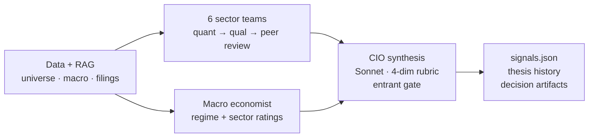

# alpha-engine-research

> Part of [**Crucible**](https://nousergon.ai) — a [Nous Ergon](https://nousergon.ai) product: a harness for rigorous AI/ML experiments in finance, an equity research-and-trading system instrumented end-to-end. Repo and S3 names use the underlying project codename `alpha-engine`.

Multi-agent investment-research pipeline. Six sector teams, a CIO, and a macro economist scan the S&P 500+400 weekly, maintain rolling investment theses, and emit `signals.json` for the rest of the system. Built on LangGraph with Anthropic Claude (Haiku per-team, Sonnet for synthesis).

> System overview, Step Function orchestration, and module relationships live in [`nousergon-docs`](https://github.com/nousergon/nousergon-docs). Code tour and key files live in [`OVERVIEW.md`](OVERVIEW.md).

## What this does

- **Six sector teams** (Tech, Healthcare, Financials, Industrials, Consumer, Defensives) run in parallel via LangGraph `Send()` fan-out. Each team: quant ReAct → qual ReAct (with RAG retrieval over SEC filings + earnings + theses) → peer review → 2–3 ranked recommendations + thesis update.
- **Macro economist** runs in parallel with a reflection loop, producing market regime + per-sector ratings that scale recommendations downstream.
- **CIO** evaluates every recommendation in a single Sonnet batch call against a 4-dimension rubric and gates new entrants per a configurable cap.
- **LLM-as-judge layer** scores agent outputs at key stages against rubric prompts. Every decision is captured to S3 with prompt metadata + cost telemetry for replay and audit.

## Phase 2 measurement contribution

This is where every agent decision in the system happens. Each one is captured as a structured artifact — prompt id + version + hash, full prompt context, input snapshot, agent output, and cost — replayable, auditable, and attributable to a specific prompt revision. The LLM-as-judge layer scores agent quality at key stages against rubric prompts. Together these are the substrate that lets Phase 3 measure whether prompt or model changes actually improve agent quality.

## Architecture

Decision-artifact capture wraps every LLM call site via `LoadedPrompt` (frontmatter-versioned prompts, sha256 body hash) and a `track_llm_cost` ContextVar accumulator that stamps token counts + cost on each invocation.

## Configuration

This repo is **public**. Agent prompts, scoring weights, universe configuration, and proprietary scoring formulas are gitignored locally and stored in the private [`alpha-engine-config`](https://github.com/nousergon/alpha-engine-config) repo. Architecture and approach are public; specific values are private.

## Sister repos

| Module | Repo |
|---|---|
| Executor | [`crucible-executor`](https://github.com/nousergon/crucible-executor) |
| Data | [`nousergon-data`](https://github.com/nousergon/nousergon-data) |
| Predictor | [`crucible-predictor`](https://github.com/nousergon/crucible-predictor) |
| Backtester | [`crucible-backtester`](https://github.com/nousergon/crucible-backtester) |
| Dashboard | [`crucible-dashboard`](https://github.com/nousergon/crucible-dashboard) |
| Library | [`nousergon-lib`](https://github.com/nousergon/nousergon-lib) |
| Docs | [`nousergon-docs`](https://github.com/nousergon/nousergon-docs) |

## License

AGPL-3.0-only — see [LICENSE](LICENSE). Commercial licenses available — contact brian@nousergon.ai.
